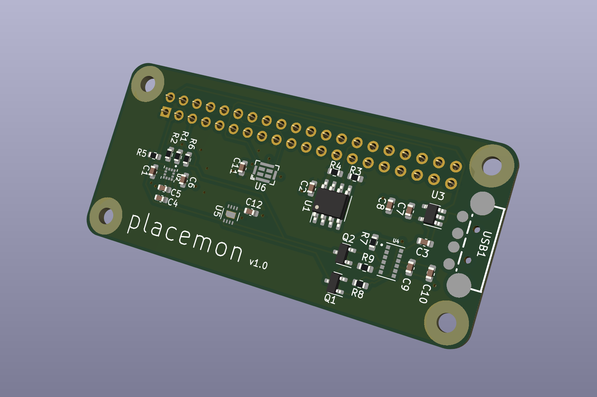

# placemon

The idea is to use the data collected from a number of sensors along with machine learning techniques to recognise different events occurring in your home.  For example processing audio data, to see if you have left a tap running.

One of the key inspirations is the paper - "Synthetic Sensors: Towards General-Purpose Sensing", I noticed some of the sensors used alone on their board such as the GridEye thermal sensor appear to be pretty expensive.  I've tried to select a smaller set of sensors that will hopefully allow us to achieve a similar level of accuracy at detecting different events.

# Sensors

* LSM303AGR - accelerometer and compass
* SHT30-DIS - temperature and humidity sensor
* GMA4030H11-F26 - PDM microphone
* VL6180V1NR - Laser ToF sensor

# To Do

* Ooops - 2.54mm pin header is in slightly wrong location, so mounting holes won't be usable currently
