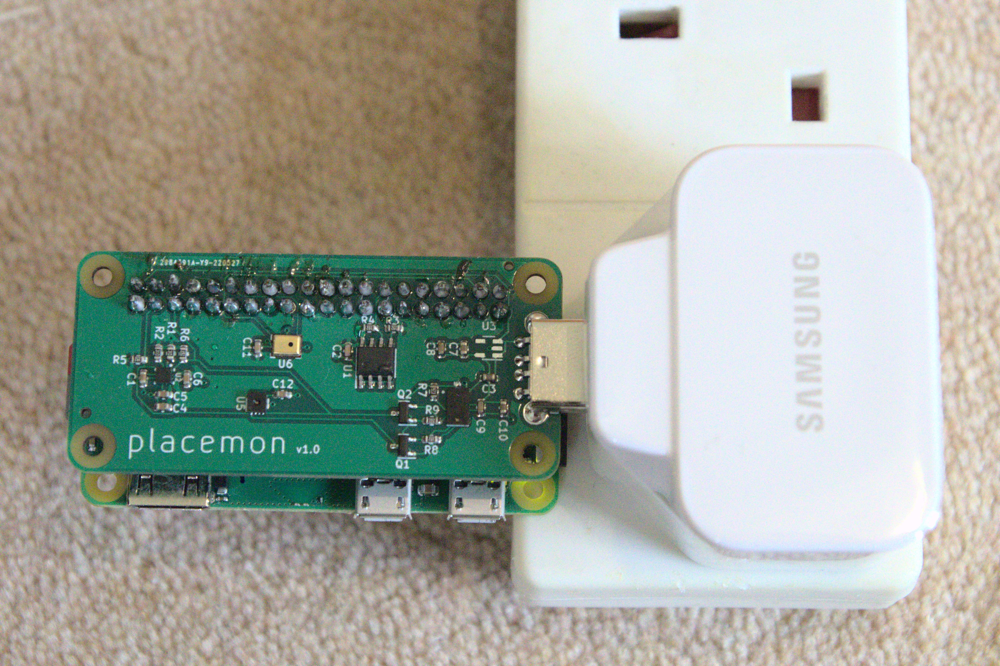
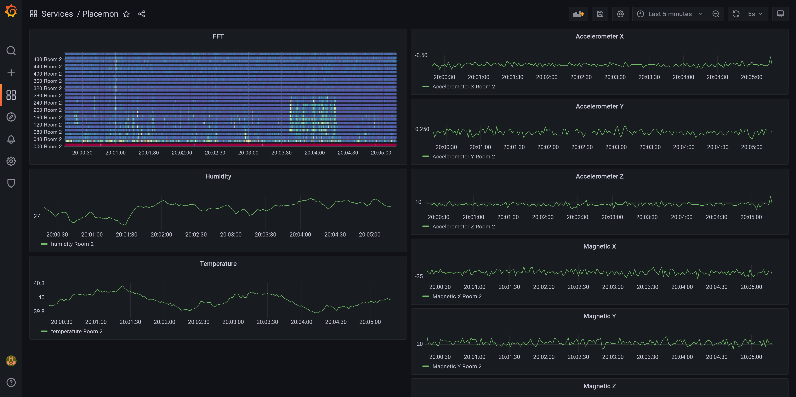

# placemon

The idea is to use the data collected from a number of sensors along with machine learning techniques to recognise different events occurring in your home.  For example processing audio data, to see if you have left a tap running.

One of the key inspirations is the paper - "Synthetic Sensors: Towards General-Purpose Sensing", I noticed some of the sensors used alone on their board such as the GridEye thermal sensor appear to be pretty expensive.  I've tried to select a smaller set of sensors that will hopefully allow us to achieve a similar level of accuracy at detecting different events.






# Sensors

* LSM303AGR - accelerometer and compass
* SHT30-DIS - temperature and humidity sensor
* GMA4030H11-F26 - PDM microphone
* VL6180V1NR - Laser ToF sensor

# To Do

* Ooops - 2.54mm pin header is in slightly wrong location, so mounting holes won't be usable currently

# Testing

Install:

```
sudo apt install python3-pip
```

Libraries for microphone:
```
sudo apt install libasound2-dev libportaudio2 libsndfile1
pip3 install sounddevice soundfile
```

Libraries for temperature and accelerometer:
```
pip3 install adafruit-circuitpython-sht31d
pip3 install adafruit-circuitpython-lsm303-accel adafruit-circuitpython-lis2mdl
```

Run:
```
import board
import busio
import adafruit_sht31d
import adafruit_lsm303_accel
import adafruit_lis2mdl

i2c = board.I2C()
accel = adafruit_lsm303_accel.LSM303_Accel(i2c)
mag = adafruit_lis2mdl.LIS2MDL(i2c)
sensor = adafruit_sht31d.SHT31D(i2c)

print("Acceleration (m/s^2): X=%0.3f Y=%0.3f Z=%0.3f"%accel.acceleration)
print("Magnetometer (micro-Teslas)): X=%0.3f Y=%0.3f Z=%0.3f"%mag.magnetic)
print('Humidity: {0}%'.format(sensor.relative_humidity))
print('Temperature: {0}C'.format(sensor.temperature))
```

# Audio 

Uses PDM driver from https://github.com/imec-int/Raspberry-Pi-Installer-Scripts

Changed the following lines, to the suggestion:

```
/home/pi/Raspberry-Pi-Installer-Scripts/pdm_mic_module/linux_bcm2835_kernel/bcm2835-i2s.c:792:3: error: ‘struct snd_soc_dai_driver’ has no member named ‘symmetric_rates’; did you mean ‘symmetric_rate’?
/home/pi/Raspberry-Pi-Installer-Scripts/pdm_mic_module/linux_bcm2835_kernel/bcm2835-i2s.c:793:3: error: ‘struct snd_soc_dai_driver’ has no member named ‘symmetric_samplebits’; did you mean ‘symmetric_sample_bits’?
```

```
arecord --device="plughw:0,0" -f S16_LE -r 44100 out.wav
```
